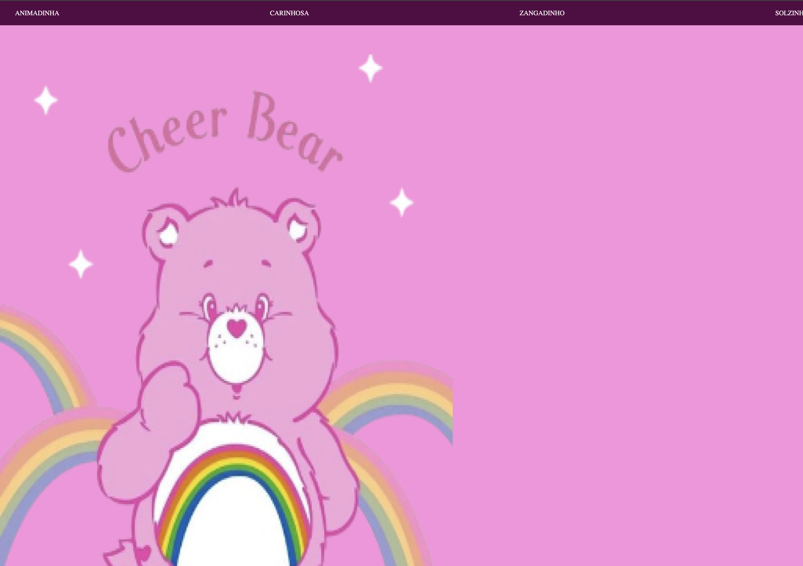

# site-vertical

# Site de rolagem colorido
---
# Ursinhos Carinhosos

---

## Sobre 
 Site divertido para testar novas habilidades e posições. O intuito deste projeto é colocar em prática o conhecimento adquirido sobre as linguagens de marcação, HTML, CSS e Markdown, realizadas no curso técnico de desenvolvimento de sistemas do [Senai Jandira](https://sp.senai.br/unidade/jandira/)

 ___

## Tecnologias utilizadas

HTML
CSS
Markdown
Git
___

## Autor

 - [Isabelly Lima](https://www.linkedin.com/in/isabelly-silva-182a99349/)

